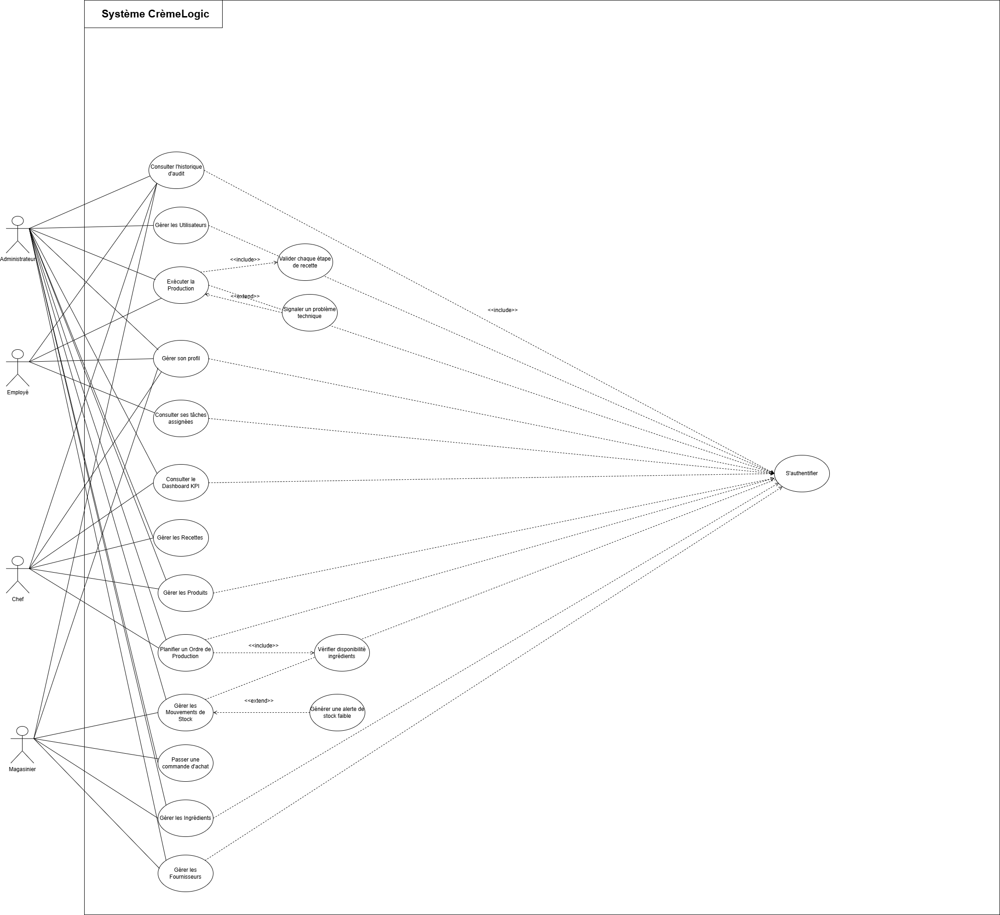
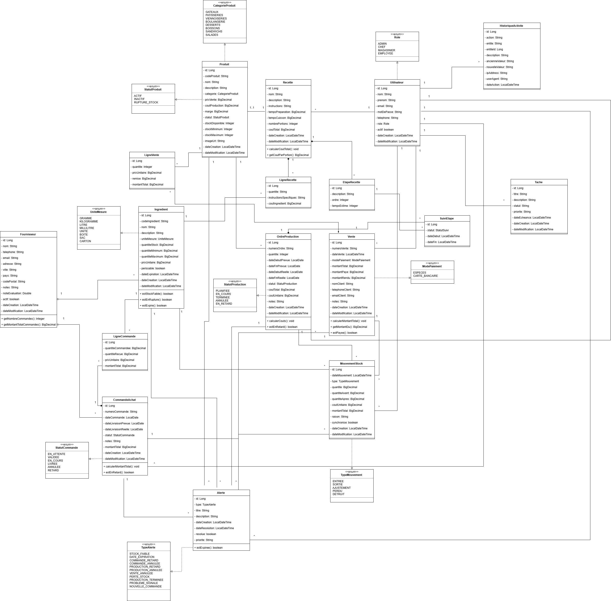

# 🧁 CrèmeLogic - Gestion de Pâtisserie

<div align="center">


**Application web complète de gestion de pâtisserie : gestion des stocks, recettes, production et ventes**

</div>

---

## 📋 Contexte du Projet
**CrèmeLogic** est une solution logicielle sur mesure conçue pour digitaliser l'intégralité des opérations d'une pâtisserie artisanale ou industrielle. Elle permet de centraliser la gestion des stocks d'ingrédients, la standardisation des recettes, le suivi des ordres de production et l'enregistrement efficace des ventes.

### Objectifs
- **Digitalisation** : Remplacer les relevés manuels par une interface intuitive.
- **Traçabilité** : Suivre chaque ingrédient, de la commande fournisseur à la vente finale.
- **Optimisation** : Réduire les pertes grâce à des alertes de stock faible et une gestion précise de la production.

---

## 👑 Fonctionnalités par Rôle

### 👑 ADMIN (Administrateur)
- **Dashboard Global** : Vue d'ensemble des revenus, dépenses et alertes critiques.
- **Gestion des Utilisateurs** : CRUD complet des comptes et rôles.
- **Paramétrage Système** : Configuration des données de base de l'entreprise.
- **Rapports** : Analyse des performances mensuelles et annuelles.

### 👨‍🍳 CHEF (Chef Pâtissier)
- **Gestion des Recettes** : Création et modification des fiches techniques avec calcul automatique des coûts.
- **Gestion des Produits** : Catalogue des pâtisseries disponibles à la vente.
- **Ordres de Production** : Planification et suivi de la fabrication quotidienne.

### 🏪 MAGASINIER (Gestionnaire de Stock)
- **Gestion des Ingrédients** : Suivi en temps réel des stocks de matières premières.
- **Gestion des Fournisseurs** : Annuaire et historique des transactions.
- **Commandes d'Achat** : Création et réception des commandes fournisseurs.
- **Mouvements de Stock** : Historique détaillé des entrées et sorties.

### 👨‍💼 EMPLOYÉ (Vendeur / Collaborateur)
- **Terminal de Vente** : Interface rapide pour l'enregistrement des ventes en magasin.
- **Mes Tâches** : Liste personnalisée des tâches de production assignées par le Chef.
- **Profil Personnel** : Suivi des statistiques individuelles de performance.

---

## 🛠️ Stack Technique

| Composant | Technologie |
|-----------|-------------|
| **Backend** | Java 17, Spring Boot 3.5.x |
| **Sécurité** | Spring Security, JWT (Stateless) |
| **Persistence** | Spring Data JPA, Hibernate, PostgreSQL |
| **Frontend** | Angular 17, RxJS |
| **Style UI** | Bootstrap 5, Vanilla CSS |
| **Conteneurisation** | Docker, Docker Compose |
| **CI/CD** | GitHub Actions |

---

## 🏗️ Architecture Applicative
L'application suit une architecture propre et moderne :
- **Backend** : Architecture en couches (`Controller` → `Service` → `Repository` → `Entity`).
- **Frontend** : Architecture basée sur les composants standalone avec services pour la communication API.
- **API** : RESTful avec documentation Swagger / OpenAPI.
- **Sécurité** : Authentification basée sur les tokens JWT avec autorisation basée sur les rôles (RBAC).

---

## 🚀 Démarrage Rapide

### Prérequis
- [Docker & Docker Compose](https://docs.docker.com/get-docker/)
- [Make](https://www.gnu.org/software/make/) (optionnel, mais recommandé pour les raccourcis)

### Installation
```bash
git clone https://github.com/ichrakjaifra/CremeLogic.ma.git
cd CremeLogic.ma
```

### Lancement avec Docker (Recommandé)
```bash
# Lancer toute la stack (DB + Backend + Frontend)
make up

# Ou via docker-compose directement
docker-compose up -d --build
```

### Accès aux services
- 🌍 **Frontend** : [http://localhost:4200](http://localhost:4200)
- ⚙️ **Backend API** : [http://localhost:8081/api](http://localhost:8081/api)

---

## 💾 Comptes de Test (Auto-générés)

| Rôle | Email | Mot de passe |
|------|-------|--------------|
| **ADMIN** | `admin@patisserie.com` | `admin123` |
| **CHEF** | `chef@patisserie.com` | `chef123` |
| **MAGASINIER** | `magasinier@patisserie.com` | `mag123` |
| **EMPLOYÉ** | `employe@patisserie.com` | `emp123` |

---

## 🛠️ Commandes Utiles (Makefile)

| Commande | Action |
|----------|--------|
| `make up` | Démarre toute l'application via Docker |
| `make down` | Arrête et supprime les conteneurs |
| `make rebuild` | Force la reconstruction des images et redémarre |
| `make logs` | Affiche les logs en temps réel |
| `make backend` | Démarre uniquement la DB et le Backend (idéal pour dev frontend local) |
| `make frontend` | Démarre le frontend en mode développement local |

---

## 🧪 Tests & Qualité
- **Backend** : Tests JUnit 5 et Mockito (`mvn test`).
- **Frontend** : Tests Jasmine et Karma (`npm test`).
- **CI/CD** : Pipeline GitHub Actions automatique validant chaque Push/PR.

---

## diagramme de cas d'utilisation


## diagramme de classe


---

<div align="center">
  Développé avec ❤️ pour l'excellence pâtissière.
</div>
